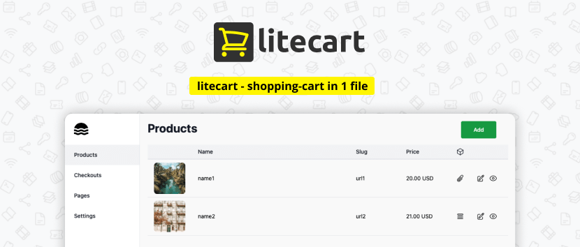

<!--
N.B.: This README was automatically generated by <https://github.com/YunoHost/apps/tree/master/tools/readme_generator>
It shall NOT be edited by hand.
-->

# Litecart for YunoHost

[](https://ci-apps.yunohost.org/ci/apps/litecart/)  

[](https://install-app.yunohost.org/?app=litecart)

*[Read this README in other languages.](./ALL_README.md)*

> *This package allows you to install Litecart quickly and simply on a YunoHost server.*  
> *If you don't have YunoHost, please consult [the guide](https://yunohost.org/install) to learn how to install it.*

## Overview

Litecart is an open source shopping-cart in 1 file of embedded database (SQLite), convenient dashboard UI and simple site.

### 🏆 Features

💰 Support for Popular Payment Systems: Accept payments seamlessly with support for popular payment systems, ensuring a smooth checkout experience for your customers.

🔑 Sell Files and License Keys: Whether you're selling digital files or license keys, litecart has you covered, providing flexibility in the types of products you can offer.

⚙️ Lightweight and Efficient: litecart utilizes SQLite as its embedded database. This results in a lightweight website that performs exceptionally well.

☁️ Easily Customizable: Modify and customize your litecart website effortlessly to match your branding and unique requirements, making it truly your own.

🧞‍♂️ Convenient Administration Panel: With a user-friendly dashboard UI, litecart offers a hassle-free administration panel, allowing you to manage your store, inventory, and orders with ease.


**Shipped version:** 0.1.12~ynh1

## Screenshots



## Documentation and resources

- Official admin documentation: <https://github.com/shurco/litecart?tab=readme-ov-file#adding-payment-systems>
- Upstream app code repository: <https://github.com/shurco/litecart>
- YunoHost Store: <https://apps.yunohost.org/app/litecart>
- Report a bug: <https://github.com/YunoHost-Apps/litecart_ynh/issues>

## Developer info

Please send your pull request to the [`testing` branch](https://github.com/YunoHost-Apps/litecart_ynh/tree/testing).

To try the `testing` branch, please proceed like that:

```bash
sudo yunohost app install https://github.com/YunoHost-Apps/litecart_ynh/tree/testing --debug
or
sudo yunohost app upgrade litecart -u https://github.com/YunoHost-Apps/litecart_ynh/tree/testing --debug
```

**More info regarding app packaging:** <https://yunohost.org/packaging_apps>
