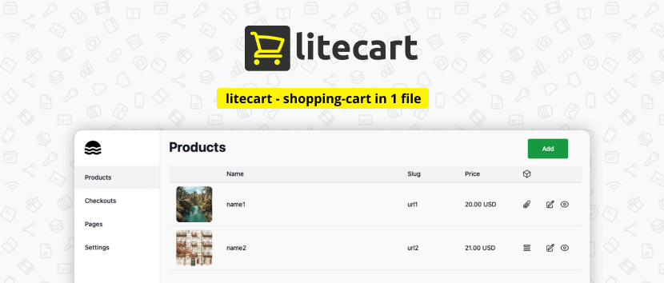

<!--
注意：此 README 由 <https://github.com/YunoHost/apps/tree/master/tools/readme_generator> 自动生成
请勿手动编辑。
-->

# YunoHost 上的 Litecart

[](https://ci-apps.yunohost.org/ci/apps/litecart/)  

[](https://install-app.yunohost.org/?app=litecart)

*[阅读此 README 的其它语言版本。](./ALL_README.md)*

> *通过此软件包，您可以在 YunoHost 服务器上快速、简单地安装 Litecart。*  
> *如果您还没有 YunoHost，请参阅[指南](https://yunohost.org/install)了解如何安装它。*

## 概况

Litecart is an open source shopping-cart in 1 file of embedded database (SQLite), convenient dashboard UI and simple site.

### 🏆 Features

💰 Support for Popular Payment Systems: Accept payments seamlessly with support for popular payment systems, ensuring a smooth checkout experience for your customers.

🔑 Sell Files and License Keys: Whether you're selling digital files or license keys, litecart has you covered, providing flexibility in the types of products you can offer.

⚙️ Lightweight and Efficient: litecart utilizes SQLite as its embedded database. This results in a lightweight website that performs exceptionally well.

☁️ Easily Customizable: Modify and customize your litecart website effortlessly to match your branding and unique requirements, making it truly your own.

🧞‍♂️ Convenient Administration Panel: With a user-friendly dashboard UI, litecart offers a hassle-free administration panel, allowing you to manage your store, inventory, and orders with ease.


**分发版本：** 0.1.12~ynh1

## 截图



## 文档与资源

- 官方管理文档： <https://github.com/shurco/litecart?tab=readme-ov-file#adding-payment-systems>
- 上游应用代码库： <https://github.com/shurco/litecart>
- YunoHost 商店： <https://apps.yunohost.org/app/litecart>
- 报告 bug： <https://github.com/YunoHost-Apps/litecart_ynh/issues>

## 开发者信息

请向 [`testing` 分支](https://github.com/YunoHost-Apps/litecart_ynh/tree/testing) 发送拉取请求。

如要尝试 `testing` 分支，请这样操作：

```bash
sudo yunohost app install https://github.com/YunoHost-Apps/litecart_ynh/tree/testing --debug
或
sudo yunohost app upgrade litecart -u https://github.com/YunoHost-Apps/litecart_ynh/tree/testing --debug
```

**有关应用打包的更多信息：** <https://yunohost.org/packaging_apps>
